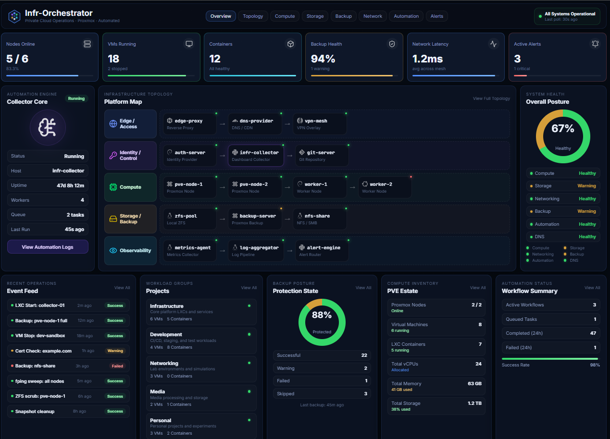
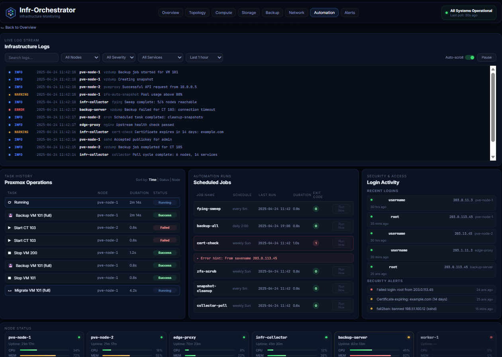

# Infr-Orchestrator

A Proxmox-based infrastructure monitoring dashboard with live data collection, topology mapping, backup posture tracking, and operations visibility.





## What This Is

Infr-Orchestrator is an open-source dashboard that gives you a single-pane view of your Proxmox homelab or private cloud. It collects data from your nodes using standard Linux CLI tools over SSH — no agents to install on your infrastructure.

It ships with:
- A static frontend that works out of the box with sample data
- A Python backend collector that polls your real infrastructure
- An operations console with live log streaming, task history, and security monitoring

## Features

### Overview Dashboard
- KPI cards: nodes online, VMs running, containers, backup health, network latency, active alerts
- Infrastructure topology map with 5 color-coded lanes (Edge, Identity, Compute, Storage, Observability)
- Live status dots on every node (up/down/degraded)
- System health ring with subsystem checklist
- Recent operations feed
- Workload group / tenant breakdown
- Backup posture with success/fail/warning breakdown
- Compute inventory (nodes, VMs, CTs, vCPUs, memory, storage)
- Automation workflow summary with success rate

### Operations Console
- Live infrastructure log stream with severity filtering
- Filter by node, severity, service, and time range
- Proxmox task history table with status pills
- Scheduled automation jobs with exit codes and error details
- Security panel: recent logins, failed attempts, fail2ban bans
- Node status strip with CPU/MEM/DISK bars per node

## Quick Start

### Option 1: Static Demo (no backend needed)

```bash
git clone https://github.com/SamuelSJames/Infr-Orchestrator.git
cd Infr-Orchestrator
python3 -m http.server 8080
```

Open `http://127.0.0.1:8080/docs/` — you'll see the dashboard with sample data.

### Option 2: Live Data (with collector backend)

1. Create a small LXC on your Proxmox cluster (Debian/Ubuntu, 512MB RAM, 4GB disk)

2. Clone the repo and run the setup script:
```bash
git clone https://github.com/SamuelSJames/Infr-Orchestrator.git
cd Infr-Orchestrator/collector
bash setup.sh
```

3. Copy your SSH public key to each Proxmox node:
```bash
ssh-copy-id root@<pve-node-ip>
```

4. Edit the config:
```bash
cp config.yaml.example config.yaml
nano config.yaml
```

5. Start the collector:
```bash
source /opt/infr-collector/venv/bin/activate
python app.py
```

Dashboard available at `http://<collector-ip>:8081`

## Project Structure

```
Infr-Orchestrator/
├── README.md
├── LICENSE
├── Dockerfile
├── index.html                    # Redirect to docs/
├── docs/                         # Frontend (static dashboard)
│   ├── index.html                # Overview dashboard
│   ├── operations.html           # Operations console
│   ├── styles.css                # Shared styles
│   ├── operations.css            # Operations page styles
│   ├── app.js                    # Overview renderer
│   ├── data.js                   # Sample data (overview)
│   ├── operations-app.js         # Operations renderer
│   ├── operations-data.js        # Sample data (operations)
│   ├── FEATURES.md               # Complete feature list
│   ├── MANDATORY-TOOLS.md        # Required tools per panel
│   └── assets/
│       ├── icons/                # 26 SVG icons (brand + UI)
│       ├── logo.svg              # Dashboard logo
│       ├── favicon.svg           # Browser tab icon
│       ├── overview.png          # Screenshot
│       └── operations.png        # Screenshot
├── collector/                    # Backend (Python data collector)
│   ├── app.py                    # Flask API server + poll loop
│   ├── config.yaml.example       # Example configuration
│   ├── requirements.txt          # Python dependencies
│   ├── setup.sh                  # One-command installer
│   └── collectors/
│       ├── ssh.py                # SSH helper (paramiko)
│       ├── ping.py               # fping → node reachability
│       ├── proxmox.py            # pvesh → VMs, CTs, storage, tasks
│       ├── system.py             # vmstat/free/df → CPU/MEM/DISK
│       ├── backup.py             # vzdump tasks → backup posture
│       ├── logs.py               # journalctl → log stream
│       └── security.py           # last/lastb/fail2ban → security
├── scripts/
│   ├── fetch-icons.sh            # Download missing icons (Linux)
│   └── fetch-icons.ps1           # Download missing icons (Windows)
└── deploy/
    ├── nginx.conf.example
    └── Caddyfile.example
```

## How It Works

```
┌─────────────────────────────────────────┐
│  Proxmox Cluster                        │
│                                         │
│  ┌──────────────┐   ┌──────────────┐    │
│  │  pve-node-1  │   │  pve-node-2  │    │
│  │  (VMs/LXCs)  │   │  (VMs/LXCs)  │    │
│  └──────┬───────┘   └──────┬───────┘    │
│         │    SSH + CLI     │            │
│         └────────┬─────────┘            │
│           ┌──────┴───────┐              │
│           │infr-collector│              │
│           │  (LXC)       │              │
│           │  Python API  │              │
│           │  fping, SSH  │              │
│           └──────┬───────┘              │
└──────────────────┼──────────────────────┘
                   │ REST API
            ┌──────┴───────┐
            │  Dashboard   │
            │  (browser)   │
            └──────────────┘
```

The collector LXC is the only component that talks to your infrastructure. It SSHs into each node, runs CLI tools (pvesh, fping, vmstat, df, journalctl, last), normalizes the output to JSON, and serves it via a REST API. The dashboard frontend fetches from the API and renders everything.

## API Endpoints

| Endpoint | Returns |
|---|---|
| `/api/dashboard` | Full overview payload |
| `/api/stats` | KPI card values |
| `/api/topology` | Topology map with live node status |
| `/api/health` | System health checklist |
| `/api/operations` | Recent operations feed |
| `/api/inventory` | Compute inventory |
| `/api/backup` | Backup posture breakdown |
| `/api/logs` | Infrastructure log stream |
| `/api/security` | Logins and security alerts |
| `/api/nodes` | Node status (CPU/MEM/DISK bars) |
| `/api/status` | Collector health check |

## Required Tools

The collector needs only two packages installed beyond what's already on a Debian/Ubuntu system:

| Package | Install |
|---|---|
| `fping` | `apt install fping` |
| `sysstat` | `apt install sysstat` |

Everything else (`pvesh`, `vmstat`, `free`, `df`, `journalctl`, `last`) is pre-installed on Proxmox and standard Linux.

See [MANDATORY-TOOLS.md](./docs/MANDATORY-TOOLS.md) for the full breakdown of which tools feed which dashboard panels.

## Customization

All dashboard data lives in `docs/data.js` (overview) and `docs/operations-data.js` (operations console). Edit these files to match your environment for the static demo, or connect the backend collector for live data.

The topology map is configured in `collector/config.yaml` — define your nodes, their roles, and which topology lane they belong to.

## Deployment

### GitHub Pages
This repo supports GitHub Pages from the `docs/` directory for the static demo.

### Docker
```bash
docker build -t infr-orchestrator .
docker run --rm -p 8080:80 infr-orchestrator
```

### Nginx / Caddy
Example configs in `deploy/`.

## License

MIT
